# COVID-19 CT Multi-class Segmentation — U-Net vs DeepLabV3+

Semantic segmentation of chest CT scans into **4 classes** — `background`, `left lung`,
`right lung`, `infection` — comparing two architectures, with **Optuna** hyperparameter
search and full experiment logging. MSc AIVC assignment (`Ergasia_2026.pdf`).

---

## 1. Problem

The [COVID-19 CT Lung and Infection Segmentation Dataset](https://zenodo.org/records/3757476)
(Zenodo 3757476) contains **20 labeled CT volumes** (NIfTI `.nii.gz`) from the Coronacases
Initiative and Radiopaedia, annotated by radiologists with **left lung (1)**, **right lung (2)**
and **infection (3)**. The task: pixel-wise segment each axial slice into these structures —
supporting automated assessment of COVID-19 lung involvement.

> Annotations license: **CC BY-NC-SA** (see `data/ReadMe.txt`).

## 2. The Idea (Methodology)

- **2D slice segmentation.** 3D volumes are sliced along the axial axis → thousands of 2D
  samples from only 20 volumes. Background-only slices (`< 50` foreground px) are dropped.
- **Preprocessing.** Clip to the lung HU window `[-1250, 250]`, min-max normalize to `[0,1]`,
  resize to `256×256`, replicate to 3 channels for ImageNet encoders.
- **Patient-level split** (14 train / 3 val / 3 test) — slices of one volume never cross
  splits, preventing data leakage.
- **Two architectures**, both via `segmentation_models_pytorch`:
  - **U-Net** — symmetric encoder–decoder with skip connections.
  - **DeepLabV3+** — atrous spatial pyramid pooling for multi-scale context.
- **Loss:** Dice + Cross-Entropy (handles strong class imbalance; infection is tiny).
- **Hyperparameter search:** **Optuna**, 5 trials × up to 50 epochs per model, maximizing
  validation mean foreground Dice. Search space: learning rate, batch size, encoder
  (`resnet18`/`resnet34`/`efficientnet-b0`), augmentation strength. Early stopping +
  `ReduceLROnPlateau`.

---

## 3. Results

Held-out **test split** (3 patients, unseen during training/tuning).

### Comparison

| Model | Dice left_lung | Dice right_lung | Dice infection | mean FG Dice | mean FG IoU | Params (M) |
|---|---|---|---|---|---|---|
| **U-Net** | **0.980** | **0.971** | **0.794** | **0.915** | **0.854** | 14.3 |
| DeepLabV3+ | 0.978 | 0.960 | 0.635 | 0.858 | 0.782 | 12.3 |

**U-Net wins**, and the gap is driven almost entirely by the **infection** class
(0.794 vs 0.635 Dice) — the hardest, smallest, most imbalanced structure.

### Per-class metrics

**U-Net**

| Class | Dice | IoU | Sensitivity | Specificity |
|---|---|---|---|---|
| background | 0.998 | 0.996 | 0.998 | 0.986 |
| left_lung | 0.980 | 0.960 | 0.976 | 0.999 |
| right_lung | 0.971 | 0.944 | 0.982 | 0.998 |
| infection | 0.794 | 0.659 | 0.770 | 0.999 |

**DeepLabV3+**

| Class | Dice | IoU | Sensitivity | Specificity |
|---|---|---|---|---|
| background | 0.998 | 0.995 | 0.998 | 0.979 |
| left_lung | 0.978 | 0.957 | 0.981 | 0.999 |
| right_lung | 0.960 | 0.923 | 0.978 | 0.997 |
| infection | 0.635 | 0.465 | 0.500 | 1.000 |

DeepLabV3+ infection **sensitivity 0.50** (vs U-Net 0.77) — it misses half the infection
pixels while specificity stays at 1.0, i.e. it under-segments the small lesions.

### Training curves (best trial)

| U-Net | DeepLabV3+ |
|---|---|
| 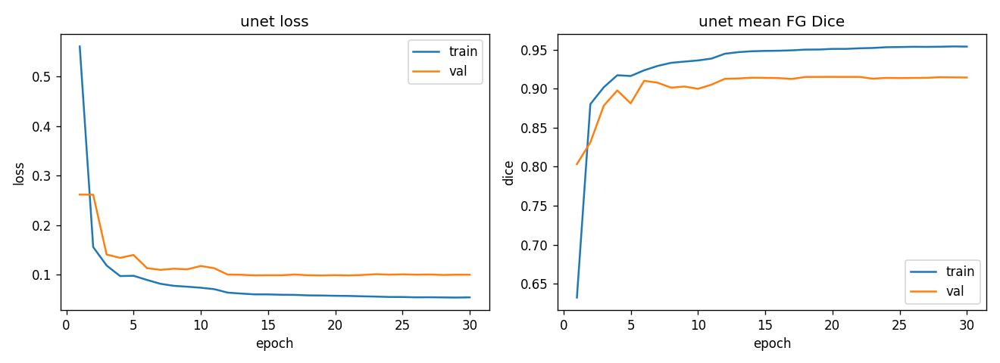 | 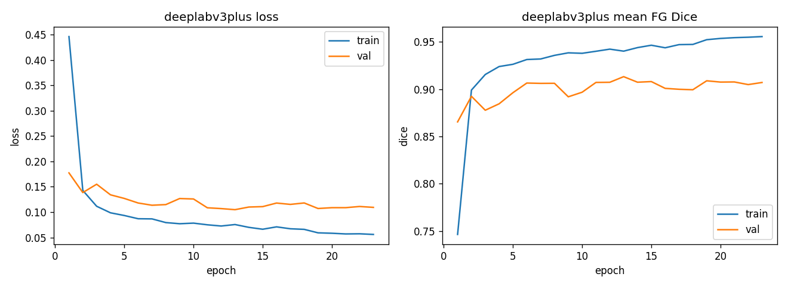 |

### Confusion matrices (pixel-level, row-normalized)

| U-Net | DeepLabV3+ |
|---|---|
| 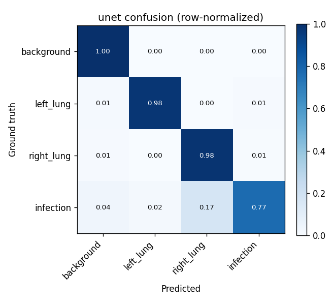 | 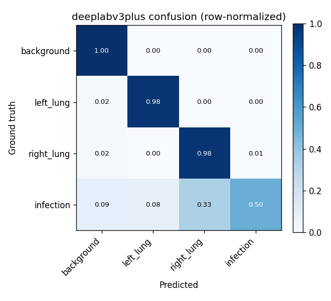 |

### Qualitative overlays (CT / ground-truth / prediction)

**U-Net**
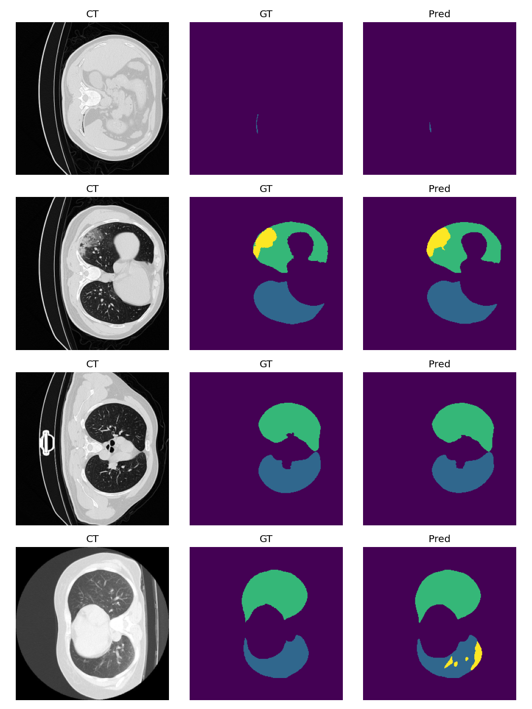

**DeepLabV3+**


---

## 4. Hyperparameter search (Optuna)

Best configuration per model (full trial log in
[`results/unet_trials.csv`](results/unet_trials.csv) /
[`results/deeplabv3plus_trials.csv`](results/deeplabv3plus_trials.csv)):

| Model | lr | batch_size | encoder | aug_strength |
|---|---|---|---|---|
| U-Net | 6.65e-4 | 16 | resnet18 | light |
| DeepLabV3+ | 1.33e-4 | 4 | resnet18 | none |

### Study visualizations

**U-Net**

| Optimization history | Param importance |
|---|---|
| 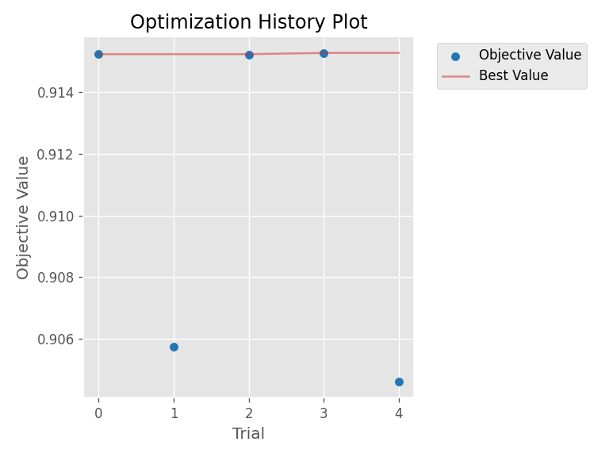 | 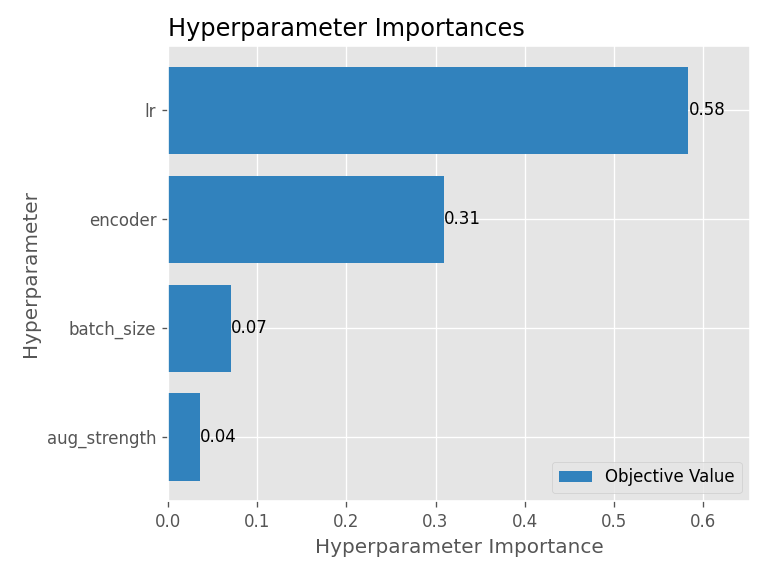 |

| Parallel coordinate | Slice |
|---|---|
| 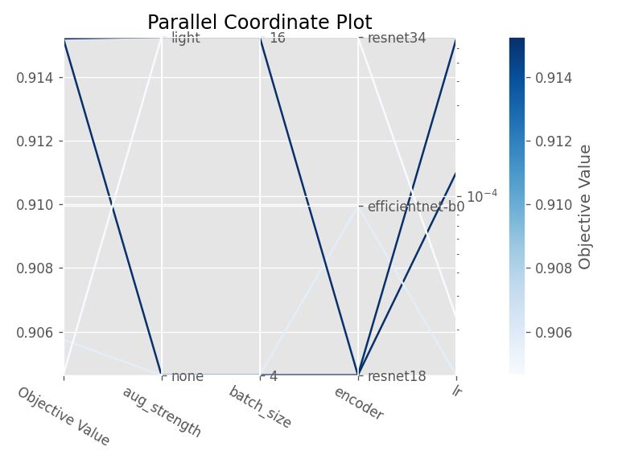 | 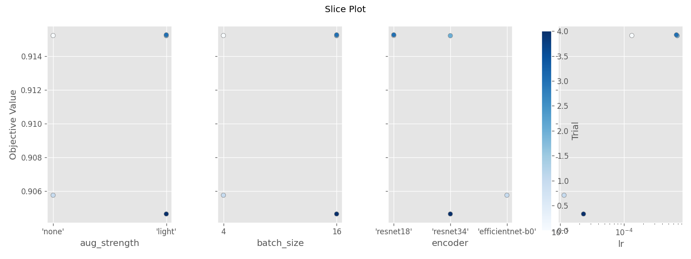 |

**DeepLabV3+**

| Optimization history | Param importance |
|---|---|
| 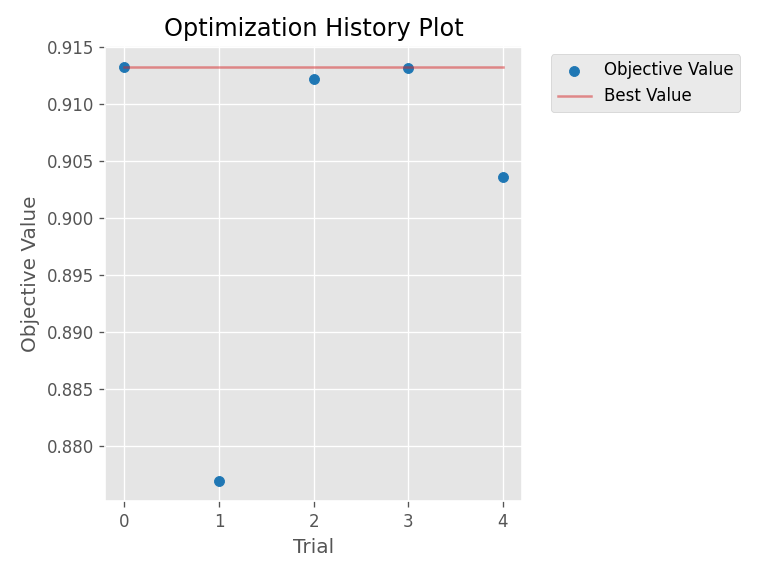 | 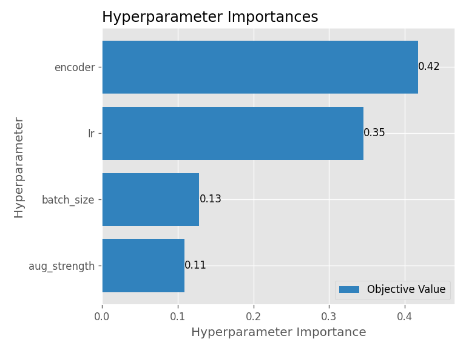 |

| Parallel coordinate | Slice |
|---|---|
| 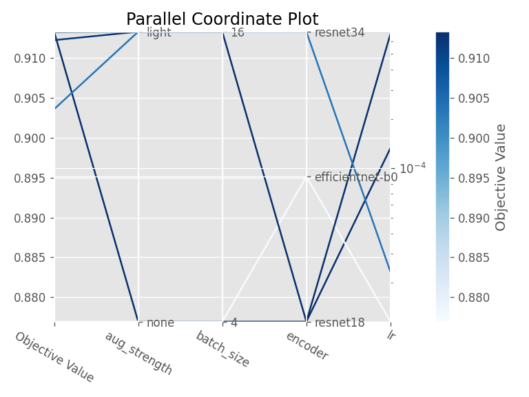 | 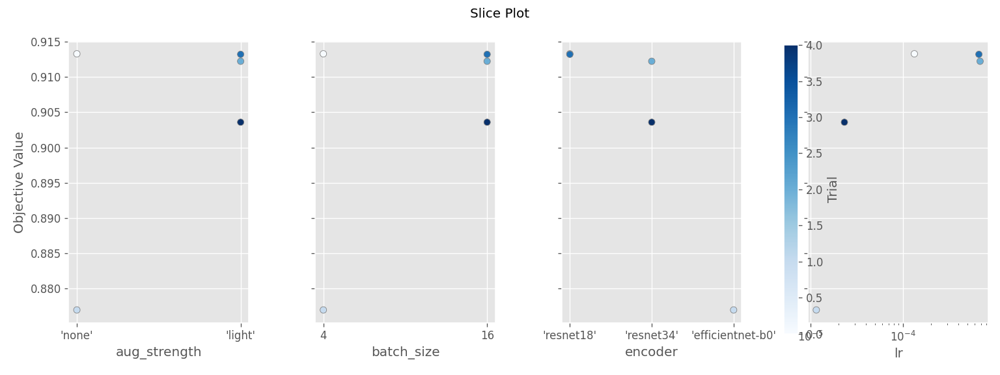 |

Every trial's full per-epoch metrics are saved as `results/<model>_trial<N>_history.json`
and `_curves.png`; the studies persist in `results/optuna_<model>.db` (SQLite, resumable).

---

## 5. Repo layout

```
src/
  config.py        # paths, classes, hyperparameters
  download_data.py # fetch + unzip dataset from Zenodo (each zip -> own subdir)
  dataset.py       # NIfTI load, windowing, slicing, split, Dataset, augment
  models.py        # U-Net / DeepLabV3+ factory (encoder configurable)
  metrics.py       # Dice, IoU, sensitivity/specificity, confusion matrix
  train.py         # train_model() core + CLI; per-epoch metric logging
  tune.py          # Optuna search per model + study plots
  eval.py          # test metrics, confusion matrix, curves, overlays
  compare.py       # comparison + best-hyperparameter tables
  smoke_test.py    # pipeline sanity checks
run_all.sh         # one-click: conda env + full pipeline (WSL/Linux)
run_all.bat        # Windows launcher -> runs run_all.sh inside WSL
results/           # all figures, reports, trial logs, Optuna studies
```

## 6. Setup & run

```bash
# one command (WSL/Linux): env + deps + download + tune + eval + compare
./run_all.sh
```

Manual:

```bash
conda create -y -n covidseg python=3.10 && conda activate covidseg
pip install torch torchvision --index-url https://download.pytorch.org/whl/cu121
pip install -r requirements.txt

python src/download_data.py     # ~1.1 GB -> data/
python src/smoke_test.py
python src/tune.py --model unet
python src/tune.py --model deeplabv3plus
python src/eval.py --model unet
python src/eval.py --model deeplabv3plus
python src/compare.py
```

> Scripts run from repo root. `data/` and `checkpoints/` are git-ignored; `results/` is
> committed so the figures above render on GitHub.

## 7. Conclusions & limitations

- **U-Net is the stronger model here**, mainly because it segments the small, scattered
  infection regions far better (Dice 0.79 vs 0.64, sensitivity 0.77 vs 0.50).
- **Lung segmentation is essentially solved** by both (Dice ≈ 0.97–0.98) — a large,
  high-contrast target.
- **Infection is the bottleneck**: tiny, low-contrast, heavily imbalanced. The Dice+CE loss
  and augmentation help but do not close the gap.
- **Small dataset (20 volumes).** Patient-level splitting keeps the evaluation honest, but
  generalization is limited; more volumes / 3D context / lesion-focused losses are the
  natural next steps.

## License

Dataset & annotations: **CC BY-NC-SA** (Ma Jun et al.). Code: for coursework use.
